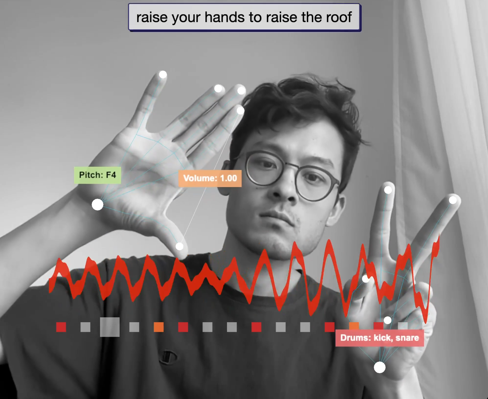

# Hand Gesture Arpeggiator

Hand-controlled arpeggiator, drum machine, and audio reactive visualizer. Raise your hands to raise the roof!

An interactive web app built with threejs, mediapipe computer vision, rosebud AI, and tone.js.

- **Right hand — melody**: raise it to raise the pitch (note lanes are drawn on screen), move it left/right to sweep the low-pass filter, pinch (thumb–index) to change volume, make a fist to cycle synth presets
- **Left hand — drums**: raise different fingers to toggle kick/snare/hihat/clap, raise or lower the hand to change the tempo, make a fist to cycle drum pattern banks (Classic / House / Funk, each with its own swing)

Extras:

- On-screen control panel: scale (minor/major pentatonic, dorian, blues), root note, synth preset, drum bank, BPM slider
- One-click performance recording (downloads a `.webm` of everything you play)
- Audio-reactive waveform that changes color with the melody and thumps on every kick

[Video](https://youtu.be/JepIs-DTBgk) | [Live Demo](https://www.funwithcomputervision.com/demo5/)



## Setup for Development

```bash
# Navigate to the project sub-folder
#(follow the steps on the main page to clone all files if you haven't already done so)
cd arpeggiator

# Serve with your preferred method (example using Python)
python -m http.server

# Use your browser and go to:
http://localhost:8000
```

## Requirements

- Modern web browser with WebGL support
- Camera access enabled for hand tracking

## Technologies

- **MediaPipe** for hand tracking and gesture recognition (hand roles are assigned from handedness, so the right hand is always melody)
- **Three.js** for audio reactive visual rendering
- **Tone.js** for synthesizer sounds, drum sequencing, effects and recording
- **HTML5 Canvas** for visual feedback
- **JavaScript** for real-time interaction

## Code Layout

- `game.js` — orchestration: camera, hand role assignment, gestures, render loop
- `MusicManager.js` — synth voice, filter/delay/reverb chain, scales, recorder
- `DrumManager.js` — drum sample playback, 16-step sequencer, pattern banks, swing
- `HandVisualizer.js` — pooled hand skeleton/label rendering (no per-frame allocations)
- `NoteLanes.js` — on-screen pitch zones with note names
- `WaveformVisualizer.js` — audio-reactive ribbon
- `Scales.js` — scale/root definitions and note-name helpers

## Key Learnings

[work in progress, to be added]
