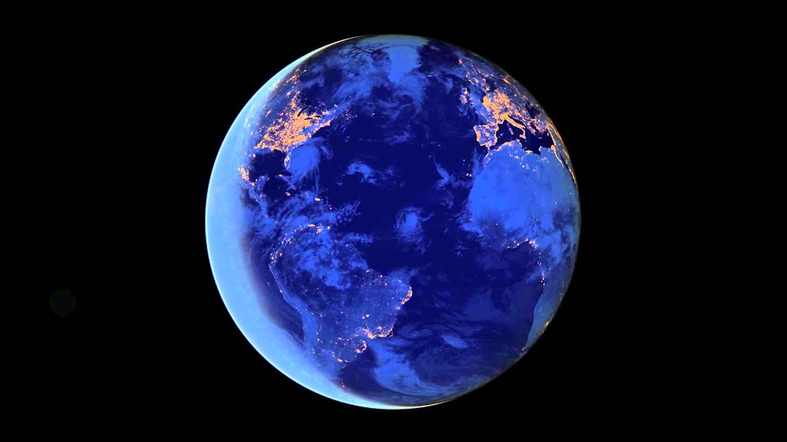

# Planet Explorer - Hand Gesture-Controlled 3D Globe

This is an interactive 3D globe application that uses hand gestures to navigate around Earth. Users can control zoom and rotation through pinch gestures with their hands.

[Video](https://youtu.be/s7_0iBvSe14) | [Live Demo](https://www.funwithcomputervision.com/planet-explorer/)

## Project Overview

### `index.html`
- Main HTML structure and configuration
- Includes Cesium.js for 3D globe rendering and MediaPipe for hand tracking
- Contains UI elements: layer controls, instructions panel, and logo
- Sets up meta tags for social sharing and analytics

### `main.js` (Core Application Logic)
- **Hand Tracking**: Uses MediaPipe to detect hand landmarks and pinch gestures
- **Globe Control**: 
  - Left hand pinch + vertical movement = zoom in/out
  - Right hand pinch + drag = rotate/pan the globe
- **Map Layers**: Three selectable base maps (terrain, streets, dark mode)
- **Safety Systems**: Extensive bounds checking and error handling to prevent crashes
- **Visual Feedback**: Draws hand landmarks on canvas overlay with gesture indicators

### `styles.css`
- Responsive design with full viewport coverage
- Retro-style UI design

## Key Technical Structure

**Core Flow:**
1. Initialize webcam → MediaPipe hands → Cesium globe
2. Process hand landmarks → detect pinch gestures → smooth movements
3. Update camera position with safety bounds → render globe + country labels

**Other Notes:**
- Uses exponential smoothing on the hand landmark positions to prevent jarring movements
- Uses fallback positions when hand tracking errors occur

### Country Info Hover
- **Functionality**: Hovering the pointing hand's index finger over a country displays an information box with its flag, name (English + Turkish), capital, population, currency, and region
- **Technical Implementation**: `viewer.scene.pick` (throttled to ~10 Hz) finds the country under the finger; details come from the bundled `country-data.json` (mledoze/countries + World Bank population), so no per-hover network requests are needed
- A mouse fallback covers devices without a camera: hover countries and drive the globe with the mouse

### Geo Quiz & Passport (educational mode)
- **Quiz**: find countries by name, flag, or capital — filtered by continent. Answer by pointing at a country and holding for a second (dwell). Score, streak, and a 30s timer per question; confetti + sounds + text-to-speech feedback
- **Passport**: every country you discover is tinted green and saved to `localStorage` ("PASSPORT: 23/176"), with a reset button
- Files: `quiz.js` (quiz + passport), `countryData.js` (local dataset loader), `effects.js` (confetti, WebAudio jingles, speech)
